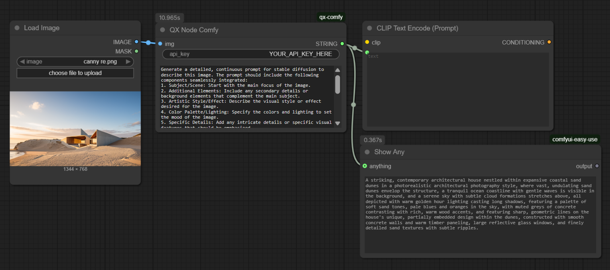

# ✨ qx-comfy: The Gemini-Powered ComfyUI Prompt Generator

Tired of manually crafting complex prompts from an initial image? The **qx-comfy** custom node brings the power of **Google's Gemini model** directly into your ComfyUI workflow, allowing you to **analyze an input image and automatically generate a rich, detailed, and continuous Stable Diffusion-ready prompt\!**

## 🖼️ Screenshots

### The QX Node Comfy in a Simple Workflow

The node takes an input **IMAGE** and your **API Key**, and outputs a detailed **STRING** prompt for your CLIP Text Encode node.



## 🚀 Key Features

  * **🖼️ Image-to-Prompt:** Simply feed an image tensor into the node, and let **Gemini Flash** analyze its contents.
  * **✍️ Detailed Prompt Structure:** The default instruction is specifically designed to create high-quality, continuous prompts with seamlessly integrated components: Subject, Artistic Style, Additional Elements, Color/Lighting, and Specific Details.
  * **⚙️ Custom Instructions:** Easily override the default instruction with your own specific prompt engineering to guide Gemini's output for highly specialized use cases.
  * **🔌 Seamless Integration:** Designed to plug directly into your text-to-image or ControlNet workflows, instantly boosting your creative iterations.

## 🛠️ Installation

### 1\. Install Custom Node

Navigate to your `ComfyUI/custom_nodes` directory and clone this repository:

```bash
cd ComfyUI/custom_nodes
git clone https://github.com/thexqin/qx-comfy qx-comfy
```

### 2\. Install Dependencies

This node requires the `google-genai` and `Pillow` libraries.

```bash
cd ComfyUI/custom_nodes/qx-comfy
pip install -r requirements.txt
```

### 3\. Restart ComfyUI

Restart your ComfyUI instance to load the new node. The node will be available in the **`qxToolbox`** category under the name **`QX Node Comfy`**.

## 💡 How to Use

### Node: `QX Node Comfy` (Category: `qxToolbox`)

| Input Name | Type | Description |
| :--- | :--- | :--- |
| **`api_key`** | `STRING` | **Your Google AI API Key.** Obtain one for free from **Google AI Studio**. **Required.** |
| **`img`** | `IMAGE` | The input image tensor from a VAE Decode, Load Image, or similar node. |
| **`prompt`** | `STRING` | The instruction for the Gemini model. **Use the default unless you are creating a custom prompt format.** |

| Output Name | Type | Description |
| :--- | :--- | :--- |
| **`STRING`** | `STRING` | The generated, detailed Stable Diffusion prompt. |

### Example Workflow

1.  Connect a **`Load Image`** or a **`VAE Decode`** node's image output to the **`img`** input of the **`QX Node Comfy`**.
2.  Paste your **Gemini API Key** into the **`api_key`** field.
3.  Connect the **`QX Node Comfy`**'s output string to the **`positive`** prompt input of a **`CLIP Text Encode`** node.
4.  Run your workflow\!

## 🔑 Configuration & Cost

### **No Credits Needed\!** (IMPORTANT)

**This custom node does NOT require you to log in, purchase credits, or subscribe to any service associated with this repository or ComfyUI.**

The node uses the **official Google GenAI SDK** and requires a personal API key which you can get **for free** (within generous usage limits) from **Google AI Studio**. You are simply leveraging the power of an external, free-to-use API service directly in your local workflow.

### API Key Security

The API key must be supplied directly to the node. **Do not commit your API key to any public repository or file.** For enhanced security, consider using a ComfyUI Manager to set environment variables for your keys instead of hardcoding them.

### Default Instruction Template

The default prompt ensures a high-quality, structured output:

```
Generate a detailed, continuous prompt for stable diffusion to describe this image. The prompt should include the following components seamlessly integrated:
1. Subject/Scene: Start with the main focus of the image.
2. Additional Elements: Include any secondary details or background elements that complement the main subject.
3. Artistic Style/Effect: Describe the visual style or effect desired for the image.
4. Color Palette/Lighting: Specify the colors and lighting to set the mood of the image.
5. Specific Details: Add any intricate details or specific visual features that should be emphasized.
Output Format:
Ensure the output is provided using the following structure:
A [Subject/Scene] in a [Artistic Style/Effect] where [Additional Elements] are present, all depicted with [Color Palette/Lighting] and featuring [Specific Details].
```

Enjoy revolutionizing your image prompting process with **qx-comfy**\! 🤖
