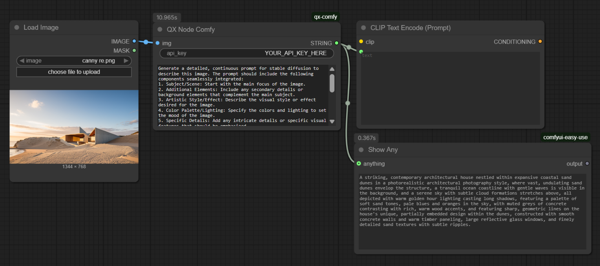
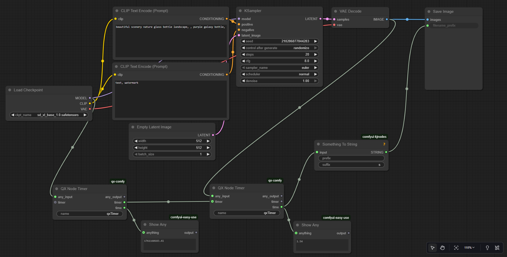

# ✨ qx-comfy: The Gemini-Powered ComfyUI Prompt Generator & Toolbox

Tired of manually crafting complex prompts from an initial image? The **qx-comfy** custom node set brings the power of **Google's Gemini model** directly into your ComfyUI workflow, allowing you to **analyze an input image and automatically generate a rich, detailed, and continuous Stable Diffusion-ready prompt\!** Additionally, the new **`qxNodeTimer`** provides a simple way to measure execution time within your workflows.

## 🖼️ Screenshots

### The QX Node Gemini in a Simple Workflow

The node takes an input **IMAGE** and your **API Key**, and outputs a detailed **STRING** prompt for your CLIP Text Encode node.


### The QX Node Timer in a Workflow

Use the timer node to track the time between two points in your workflow.


## 🚀 Key Features

  * **🖼️ Image-to-Prompt (QX Node Gemini):** Simply feed an image tensor into the node, and let **Gemini Flash** analyze its contents.
  * **✍️ Detailed Prompt Structure:** The default instruction for Gemini is designed to create high-quality, continuous prompts for Stable Diffusion.
  * **⚙️ Custom Instructions:** Easily override the default instruction for specialized use cases.
  * **⏱️ Workflow Timing (QX Node Timer):** Accurately measure the execution time of any section of your ComfyUI graph.
  * **🔌 Seamless Integration:** Both nodes are designed to plug directly into your existing ComfyUI workflows.

## 🛠️ Installation

### 1\. Install Custom Node

Navigate to your `ComfyUI/custom_nodes` directory and clone this repository:

```bash
cd ComfyUI/custom_nodes
git clone https://github.com/thexqin/qx-comfy qx-comfy
```

### 2\. Install Dependencies

This node set requires the `google-genai` and `pillow` libraries. You can use the provided batch file or run the following commands:

```bash
cd ComfyUI/custom_nodes/qx-comfy
pip install -r requirements.txt
```

**Alternative (for embedded Python on Windows):**

Run the provided `install.bat` file from the custom node directory:

```bash
..\..\..\python_embeded\python.exe -m pip install -U -r requirements.txt
```

### 3\. Restart ComfyUI

Restart your ComfyUI instance to load the new nodes. The nodes will be available in the **`qxToolbox`** category under the names **`QX Node Gemini`** and **`QX Node Timer`**.

## 💡 How to Use

All nodes are found under the **`qxToolbox`** category.

### Node: `QX Node Gemini` (Prompt Generation)

| Input Name | Type | Description |
| :--- | :--- | :--- |
| **`api_key`** | `STRING` | **Your Google AI API Key.** Obtain one for free from **Google AI Studio**. **Required.** |
| **`IMAGE`** | `IMAGE` | The input image tensor from a VAE Decode, Load Image, or similar node. |
| **`prompt`** | `STRING` | The instruction for the Gemini model. **The default instruction is recommended for stable diffusion prompts.** |

| Output Name | Type | Description |
| :--- | :--- | :--- |
| **`STRING`** | `STRING` | The generated, detailed Stable Diffusion prompt. |

#### Example Workflow for Gemini

1.  Connect a **`Load Image`** or a **`VAE Decode`** node's image output to the **`IMAGE`** input of the **`QX Node Gemini`**.
2.  Paste your **Gemini API Key** into the **`api_key`** field.
3.  Connect the **`QX Node Gemini`**'s output string to the **`positive`** prompt input of a **`CLIP Text Encode`** node.
4.  Run your workflow\!

### Node: `QX Node Timer` (Workflow Timing)

This node has two functions: **Start** and **Stop**. It toggles between these based on whether a `TIMER` object is provided to its optional input.

| Input Name | Type | Description |
| :--- | :--- | :--- |
| **`any_input`** | `ANY` | Any type of input (e.g., conditioning, model, latent). Connect to this to pass data through the timer. |
| **`name`** | `STRING` | A name for the timer instance (e.g., 'Ksampler duration'). |
| **`timer`** | `TIMER` | **(Optional)** Connect the output `timer` from a previous `QX Node Timer` node here to **stop** the timer. |

| Output Name | Type | Description |
| :--- | :--- | :--- |
| **`any_output`** | `ANY` | Passes the `any_input` through to the next node. |
| **`timer`** | `TIMER` | The unique timer object. Connect this to a subsequent `QX Node Timer` to stop the measurement. |
| **`time`** | `FLOAT` | If starting, outputs the start time. If stopping, outputs the **elapsed time in seconds**. |

#### Example Workflow for Timer

1.  Use the first **`QX Node Timer`** node (let's call it **Timer-Start**) and connect a data line (e.g., a `MODEL`) to its `any_input`. This **starts** the timer and outputs a `timer` object.
2.  Run the workflow section you want to measure (e.g., an entire Ksampler block) using the `any_output` from **Timer-Start**.
3.  Connect the output `timer` from **Timer-Start** to the optional `timer` input of a second **`QX Node Timer`** node (let's call it **Timer-Stop**).
4.  The `time` output of **Timer-Stop** will now contain the **elapsed time** for the section between the two nodes.

## 🔑 Configuration & Cost

### **No Credits Needed\!** (IMPORTANT)

**This custom node set does NOT require you to log in, purchase credits, or subscribe to any service associated with this repository or ComfyUI.**

The **`QX Node Gemini`** uses the **official Google GenAI SDK** and requires a personal API key, which you can get **for free** (within generous usage limits) from **Google AI Studio**. You are simply leveraging the power of an external, free-to-use API service directly in your local workflow.

### API Key Security

The API key for the Gemini node must be supplied directly to the node. **Do not commit your API key to any public repository or file.** For enhanced security, consider using a ComfyUI Manager to set environment variables for your keys instead of hardcoding them.

### Default Instruction Template (QX Node Gemini)

The default prompt ensures a high-quality, structured output:

```
Generate a detailed, continuous prompt for stable diffusion to describe this image. The prompt should include the following components seamlessly integrated:
1. Subject/Scene: Start with the main focus of the image.
2. Additional Elements: Include any secondary details or background elements that complement the main subject.
3. Artistic Style/Effect: Describe the visual style or effect desired for the image.
4. Color Palette/Lighting: Specify the colors and lighting to set the mood of the image.
5. Specific Details: Add any intricate details or specific visual features that should be emphasized.
Output Format:
Ensure the output is provided using the following structure:
A [Subject/Scene] in a [Artistic Style/Effect] where [Additional Elements] are present, all depicted with [Color Palette/Lighting] and featuring [Specific Details].
```

Enjoy revolutionizing your image prompting process and tracking your workflow performance with **qx-comfy**\! 🤖
